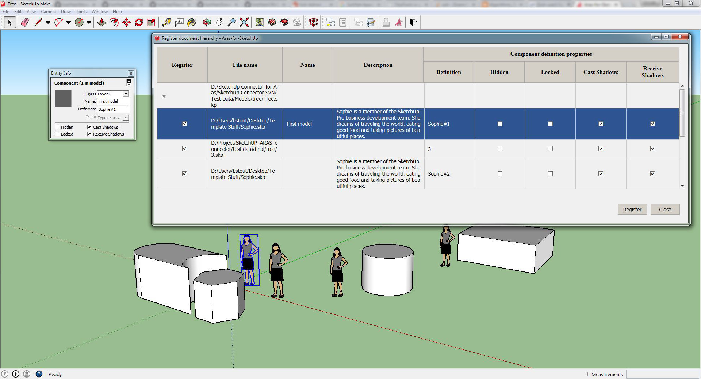

>## Archived Aras Community Project
*This project has been migrated to GitHub from the old Aras Community Solutions page. As an Archived project, this project is no longer being actively developed or maintained.*

# Aras-for-SketchUp

**Aras-for-SketchUp™** is a SketchUp® add-in that connects it to Aras® Innovator® and provides direct access to PLM functionality from SketchUp design software.

Aras-for-SketchUp enables users to:

* Manage CAD documents using the distinct SketchUp Package for Aras Innovator.
* Register SketchUp document or document hierarchy into Aras Innovator PLM system.
* Retrieve Document from PLM system and open it in SketchUp.
* Perform lock/Unlock operations directly from SketchUp.
* Store document modifications to Aras Innovator.
* Launch SketchUp application to review and edit the selected model directly from the Aras Innovator PLM system.

The add-in is compatible with SketchUp 2014 and SketchUp 2015.

## History

This project was migrated from the old Aras Community Solutions site.

Release | Notes
--------|--------
[v1.1](https://github.com/ArasLabs/aras-for-sketchup/releases/tag/v1.1) | The new version allows opening the selected model in SketchUp application immediately by clicking on the action in Aras Innovator, along with managing documents using the distinct SketchUp Package for Aras Innovator. The add-in supports SketchUp 2014 and SketchUp 2015.

#### Supported Aras Versions

Project | Aras
--------|------
[v1.1](https://github.com/ArasLabs/aras-for-sketchup/releases/tag/v1.1) | 10.0 SPx

## Installation

#### Important!
**Always back up your code tree and database before applying an import package or code tree patch!**

### Pre-requisites

1. Aras Innovator installed (version 10.0 SPx preferred)
2. Aras Package Import tool
3. Aras for SketchUp import package
4. SketchUp installed
5. Internet Explorer 9, 10, or 11 installed

### Install Steps

#### SketchUp Extension

The SketchUp extension should be installed using the SketchUp interface:

1. In SketchUp, select **Window > Preferences > Extensions > Install Extension**.
2. Select the `AMC_Aras-for-SketchUp_v1.1.rbz` file to install the extension.

#### Aras Innovator Database Package

1. Backup your database and store the BAK file in a safe place.
2. Open up the Aras Package Import tool.
3. Enter your login credentials and click **Login**
    * _Note: You must login as root for the package import to succeed!_
4. Enter the package name in the TargetRelease field.
    * Optional: Enter a description in the Description field.
5. Enter the path to your local `..\SketchUp for Aras\Import\imports.mf` file in the Manifest File field.
6. Select **SketchUp for Aras** in the Available for Import field.
7. Select Type = **Merge** and Mode = **Thorough Mode**.
8. Click **Import** in the top left corner.
9. Close the Aras Package Import tool.

#### Browser Configuration

The Aras for SketchUp project uses ActiveX controls, so Internet Explorer must be configured to allow ActiveX controls. Note that Firefox does not support ActiveX controls and cannot be used with the Aras for SketchUp project.

1. Open the Internet Options dialog.
2. Click **Secturity > Trusted Sites > Custom Level.**
3. Under "ActiveX controls and plug-ins", enable **Initialize and script ActiveX controls not marked as safe for scripting**.
4. Click **OK** to confirm your changes and close the Internet Options dialog.

> Note: These steps assume that Internet Explorer is already configured for use with Aras Innovator and the Aras url is added to the Trusted Sites list. If IE is not configured, see the client setup guide for your version of Aras Innovator.

You are now ready to use the Aras for SketchUp extension.

## Usage

<!-- Add usage steps here -->

## Credits

Created by AMC Bridge Support Team.

## License

Aras Labs projects are published to Github under the MIT license. See the [LICENSE file](./LICENSE.md) for license rights and limitations.
